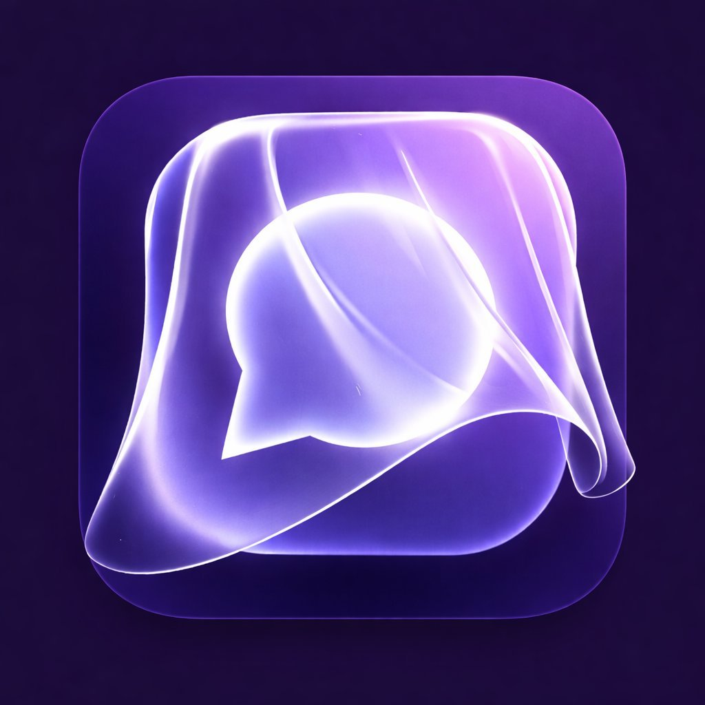

<div align="center">
  
  <h1>VeilSpace</h1>
  <p><strong>Speak Freely. Stay Unseen.</strong></p>
  <p>Marketing landing page for the VeilSpace anonymous social app — built with Next.js 15, TypeScript, and Supabase.</p>

  
  
  
  
</div>

---

## Overview

VeilSpace is an anonymous social app launching on iOS and Android. This repository contains the **marketing landing page** — a fully responsive, dark-themed Next.js site that captures waitlist signups directly into Supabase.

**Live URL:** [veils.space](https://veils.space)

---

## Features

- ⚡ **Next.js 15 App Router** with static export
- 🎨 **Custom dark design system** — CSS variables, no UI library dependency
- 📱 **Fully responsive** — mobile-first, tested down to 375px
- 🗃️ **Supabase waitlist** — email captured with duplicate detection
- 🎭 **Scroll animations** — IntersectionObserver-based reveal
- 🌐 **SEO ready** — Open Graph, Twitter Card, sitemap-friendly metadata
- 🖼️ **PWA manifest** — installable on mobile with correct icons

---

## Tech Stack

| Layer | Technology |
|---|---|
| Framework | Next.js 15 (App Router) |
| Language | TypeScript 5 |
| Styling | CSS Variables + inline styles |
| Database | Supabase (PostgreSQL) |
| Fonts | Cinzel + Plus Jakarta Sans (Google Fonts) |
| Deployment | Vercel (recommended) |

---

## Getting Started

### Prerequisites

- Node.js 18+
- npm or yarn
- A Supabase project (free tier works)

### Installation

```bash
# Clone the repo
git clone https://github.com/your-org/veilspace-landing.git
cd veilspace-landing

# Install dependencies
npm install

# Start the dev server
npm run dev
```

Open [http://localhost:3000](http://localhost:3000) in your browser.

---

## Supabase Setup

The waitlist form writes emails to a `waitlist` table. Create it once in your Supabase SQL editor:

```sql
create table waitlist (
  id         uuid primary key default gen_random_uuid(),
  email      text unique not null,
  created_at timestamptz default now()
);

-- Optional: enable row-level security
alter table waitlist enable row level security;

-- Allow anonymous inserts (the anon key is used client-side)
create policy "Allow insert"
  on waitlist for insert
  with check (true);
```

The Supabase credentials are already configured in `app/lib/supabase.ts`. To change them, update the two constants there.

---

## Adding App Screenshots

The phone mockups in the **App Preview** section are currently placeholders. Once your Canva screenshots are ready:

1. Export each screen as PNG at **400 × 830 px** (or 2× at 800 × 1660 px for retina)
2. Drop the files into `public/images/screens/`:

```
public/
└── images/
    └── screens/
        ├── auth.png       ← Login / Sign Up
        ├── feed.png       ← Home Feed
        ├── discover.png   ← Discover Spaces
        ├── post.png       ← Post & Comments
        └── compose.png    ← Compose Post
```

3. In `app/components/AppPreview.tsx`, inside each screen card, replace the placeholder `<div>` with:

```tsx

```

Repeat the same swap in `app/components/Hero.tsx` for the hero phone image:

```tsx
// Replace the placeholder div with:

```

---

## Adding the Demo Video

In `app/components/VideoDemo.tsx`, set your YouTube video ID:

```ts
const YOUTUBE_VIDEO_ID = 'YOUR_VIDEO_ID'; // ← replace this
```

Or to use a self-hosted video, replace the `<iframe>` with a `<video>` tag pointing to your file.

---

## Project Structure

```
veilspace/
├── app/
│   ├── components/
│   │   ├── Navbar.tsx          # Sticky nav with scroll effect + logo
│   │   ├── Hero.tsx            # Hero section + floating phone mockup
│   │   ├── HowItWorks.tsx      # 4-step how-it-works cards
│   │   ├── Features.tsx        # Feature grid (6 cards)
│   │   ├── VideoDemo.tsx       # YouTube / video embed section
│   │   ├── AppPreview.tsx      # Horizontal scroll of phone screenshots
│   │   ├── Spaces.tsx          # Pill grid of 44+ spaces
│   │   ├── Waitlist.tsx        # Email capture → Supabase
│   │   ├── Footer.tsx          # Footer with links + logo
│   │   └── ScrollReveal.tsx    # IntersectionObserver for .reveal elements
│   ├── lib/
│   │   └── supabase.ts         # Supabase client singleton
│   ├── favicon.ico             # Multi-size favicon (16/32/48px)
│   ├── globals.css             # Design tokens + animations + media queries
│   ├── layout.tsx              # Root layout + full SEO metadata
│   └── page.tsx                # Page — composes all sections
├── public/
│   ├── logo.png                # App icon (1024×1024)
│   ├── apple-touch-icon.png    # 180×180 for iOS home screen
│   ├── icon-192.png            # PWA icon
│   ├── icon-512.png            # PWA icon
│   ├── favicon-16.png          # Browser tab fallback
│   ├── favicon-32.png          # Browser tab fallback
│   ├── site.webmanifest        # PWA manifest
│   └── images/
│       └── screens/            # ← drop Canva screenshots here
├── next.config.ts
├── tsconfig.json
└── README.md
```

---

## Deployment

### Vercel (recommended)

```bash
npm i -g vercel
vercel
```

Vercel auto-detects Next.js. No extra config needed.

### Manual build

```bash
npm run build   # produces .next/
npm run start   # serves the production build locally
```

---

## Environment Variables

No `.env` file is required — the Supabase anon key is safe to expose client-side (it's a public key with row-level security). If you ever want to move credentials out of source code:

```env
# .env.local
NEXT_PUBLIC_SUPABASE_URL=https://your-project.supabase.co
NEXT_PUBLIC_SUPABASE_ANON_KEY=your-anon-key
```

Then update `app/lib/supabase.ts` to read `process.env.NEXT_PUBLIC_SUPABASE_URL` etc.

---

## License

MIT © 2025 VeilSpace
